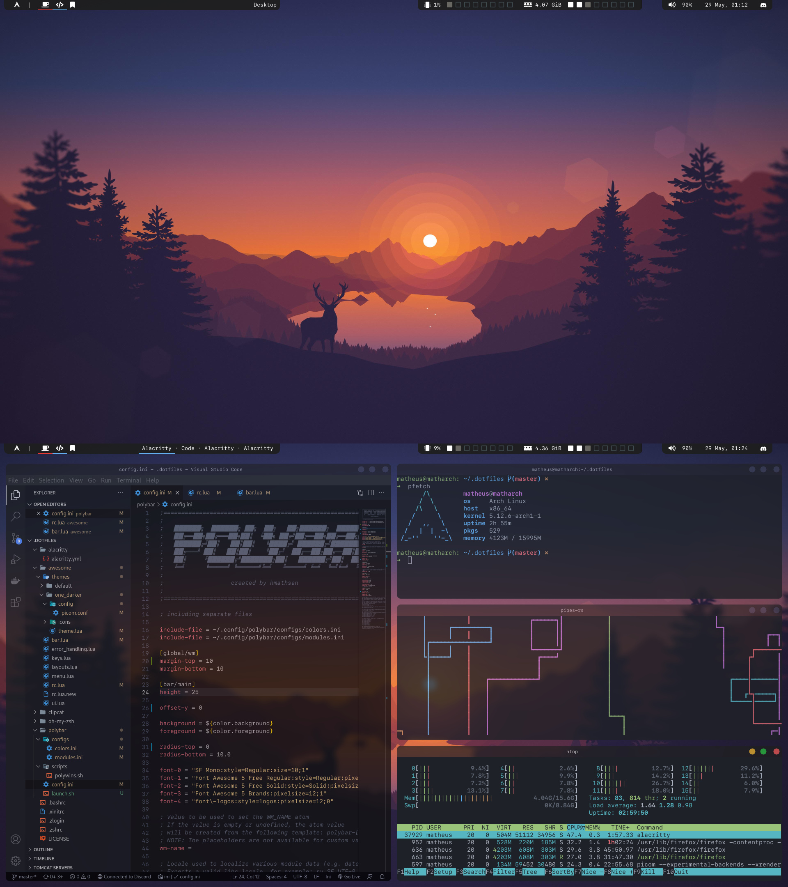

# Arch dotfiles setup

## Screenshots

## Dependencies
- SF Mono font
- Font Awesome font
- font-logos font

## Programs used in the screenshot
- [pfetch](https://github.com/dylanaraps/pfetch) - A minimalist neofetch alternative
- [pipes-rs](https://github.com/lhvy/pipes-rs) - A pipes.sh alternative written in rust
- [htop](https://htop.dev/) - A terminal process viewer
